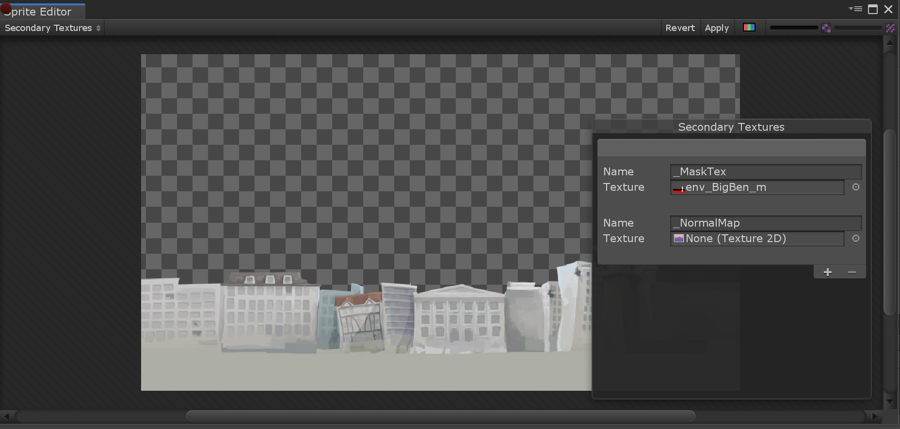

# Setting up normal map and mask Textures

2D Lights can interact with __normal map__ and __mask__ Textures linked to Sprites to create advanced lighting effects. To link these additional Textures to your Sprite, select the Sprite and open the [Sprite Editor](https://docs.unity3d.com/Manual/SpriteEditor.html). Select the __Secondary Textures__ module from the drop-down menu at the top left of the __Sprite Editor__ window.

To add a new Secondary Texture entry, select the ‘‘+’’ at the bottom right of the __Secondary Textures__ panel. Each Secondary Texture appears as its own entry in a list, each with two fields: Name and Texture. 

You can enter a custom Name for the Secondary Texture, however some Unity packages may suggest Texture names that allow the Secondary Texture be used with their Shaders, such as the 2D Lights package.

Use the drop-down arrow to the right of the Name field to display the list of suggested names. With the 2D Lights package installed, you will find the suggested names ‘MaskTex’ and ‘NormalMap’ available from the menu. Select the name that matches the function of the selected Texture - for this package, select ‘MaskTex’ for a masking Texture, or ‘NormalMap’ for a normal map Texture. 

Assign a Texture2D Asset to the Texture field by dragging the Texture Asset directly onto the Texture box, or open the __Object Picker__ window by selecting the circle to the right and select a Texture2D Asset from the list.

Select __Apply__ on the toolbar to save your entries. Entries without a Name or selected Texture are considered invalid and are automatically removed when changes are applied.